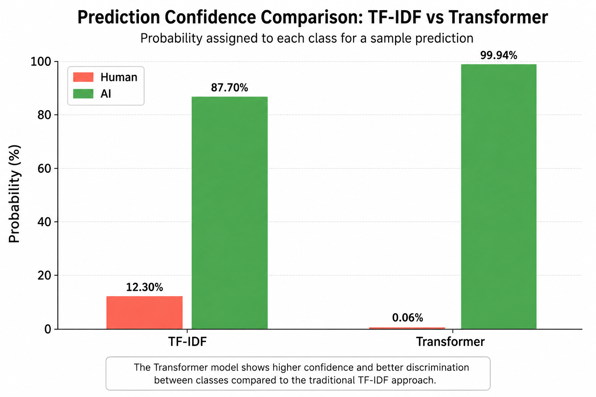

# 🤖 AI vs Human Text Detection

## 📌 Overview

This project explores the use of Natural Language Processing (NLP) techniques to distinguish between human-written and AI-generated text.

The objective was to compare a traditional NLP approach based on TF-IDF features with a modern Transformer-based approach using DistilBERT embeddings, evaluating their effectiveness on a binary text classification task.

---

## 🛠️ Tools & Technologies

- Python
- Pandas
- NumPy
- Matplotlib
- Scikit-learn
- spaCy
- Transformers (Hugging Face)
- DistilBERT

---

## 📂 Dataset

The dataset contains text samples labeled as either:

- Human-written
- AI-generated

It was used to train and evaluate binary classification models capable of identifying the origin of each text.

---

## 🔄 Methodology

The project followed the complete NLP workflow:

- Data exploration and preprocessing
- Text cleaning
- Tokenization and lemmatization using spaCy
- Stopword removal
- Feature extraction using TF-IDF
- Contextual embeddings generated with DistilBERT
- Model training and evaluation
- Performance comparison between traditional and Transformer-based approaches

---

## 🤖 Models Compared

Two different NLP strategies were evaluated:

### TF-IDF + Logistic Regression

A traditional machine learning pipeline using TF-IDF vectorization combined with Logistic Regression as the classifier.

### DistilBERT Embeddings + Logistic Regression

A Transformer-based approach where contextual embeddings generated by DistilBERT were used as features for Logistic Regression.

---

## 📈 Results

Both models achieved excellent classification performance.

The Transformer-based approach produced more confident predictions and achieved the highest overall accuracy during evaluation, demonstrating the advantage of contextual embeddings over traditional TF-IDF representations.

  

*Prediction confidence comparison for a sample text classified by both models.*

---

## 🎯 Key Findings

- Successfully classified AI-generated and human-written text.
- Compared classical and modern NLP approaches.
- DistilBERT embeddings achieved the best overall performance.
- Demonstrated the effectiveness of contextual language representations for binary text classification.

---

## 🚀 Future Improvements

Possible extensions of the project include:

- Fine-tuning DistilBERT instead of using frozen embeddings.
- Evaluating additional Transformer architectures.
- Testing on larger and more diverse datasets.
- Deploying the model as a web application for real-time predictions.
